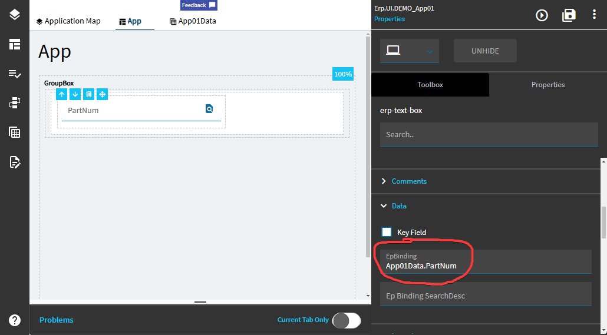
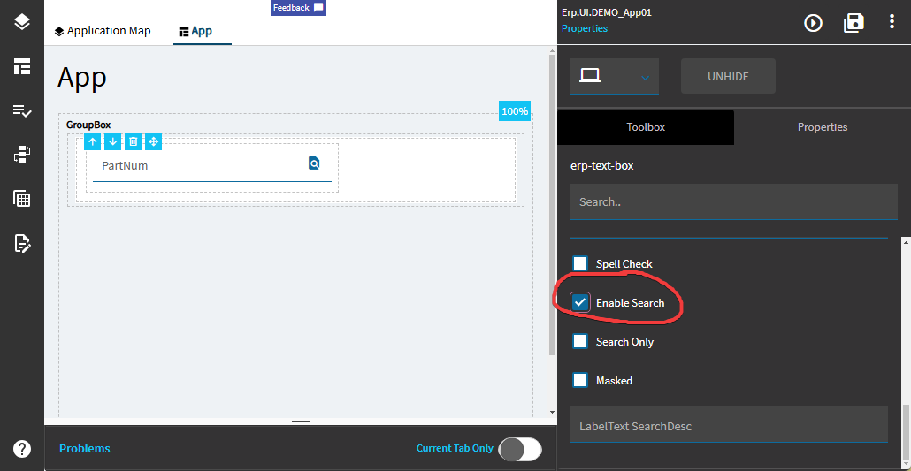
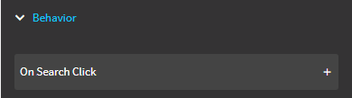
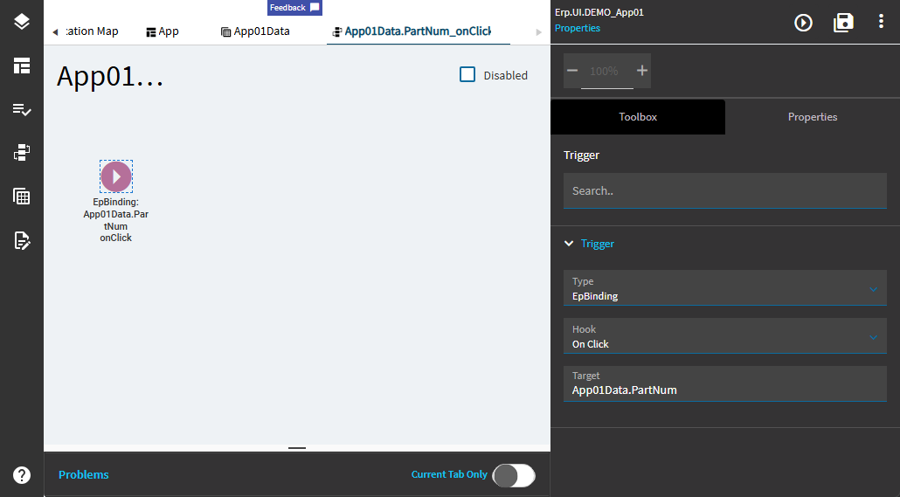
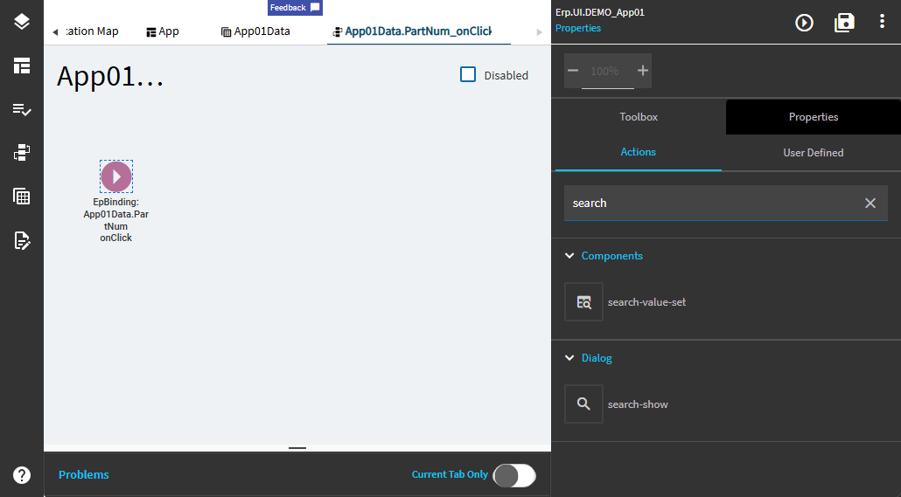
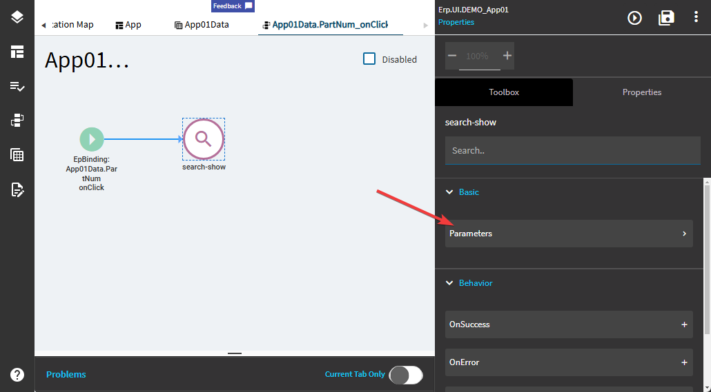

# Creating a text box with a search field

## Epicor Versions:

* 2023.1

## Overview

In this demo, we will add a text box to a Kinetic application and configure it to use a built-in Epicor search to search for a Part Number, which will then be populated into the text box on our form.

## Important Notes

1. You need to have the text box bound to a field in a DataView for this to work.

## Instructions

Add a text box to your Kinetic application and bind it to a column in a DataView available in your app:

Check the "Enable Search" checkbox:

Scroll back up in the Properties window, expand "Behavior" and click "On Search Click":

Epicor will create a new event and bind it to the on-click event for the DataView field your search box is bound to:

Open the "Toolbox" tab and type "search" in the search box. You will see two search components that can be added:

First, drag the "search-show" component into the event editor so that it connects. Open the Properties panel and click on the "Parameters" option under the "Basic" heading:

Click on the "Search Options" button in the Parameters window to reveal the search options. In the "Like *" column, you will need to type the name of an Epicor search. Epicor does not provide a list of acceptable values to put here, nor provide information on how to determine what values are valid. Instead, the name of the field is "Like *" and the _extremely_ helpful tooltip text is "Set the like property of the search form."

Since none of that is remotely helpful, I will provide an example of how to add a search for a Part Number, and leave it up to you to figure out how to add the appropriate value here to get the proper search set up.

Despite the use of the term "Like" in this field, you will need to enter the exact text necessary to configure a very specific search.

To get our search working, we only need to pick a "Select Mode" from the dropdown (SingleSelect) and enter the exact, precise, absolute, complete name of what we are searching for in the "Like *" column. In our case, we are looking in the Part table for a Part Number, so we will enter **Part.PartNum** here:

This is enough to cause the search panel to slide open and allow the user to search for and select a Part Number from the list. But we still need to store the value the user selected into our DataView field.

In the toolbox window, enter "search" in the search box to display a list of available components to add to our event:

Drag the "search-value-set" component into the event editor so that it connects to the "search-show" event. Switch to the "Properties" tab and enter the DataView.Field that you want to **store the value it** in the **EpBinding** field. Then enter **searchResult.PartNum** in the **Value** field. The **searchResult** object is a built-in system DataView available on any Kinetic application. The **PartNum** field is populated from the search reselt the user selected in the search panel. If you are using a different search, you will need to set the correct field name for the row that was selected in the search.

Save the app and click the "Preview" button to test the application:

![Animated gif showing our application in AppStudio. The user clicks on the "Save" icon and then the "Preview" icon. The application loads a blank page with a text box labeled "PartNum." The user clicks the "Search" icon inside the text box and a search panel is opened, showing options for a Part search. The user types "M2S" into the "Starting at" field in the search panel and clicks "Search." The application loads a set of part numbers beginning with "M2S" into the search results. The user checks a checkbox on one of the rows containing the Part Number "M2SXXX" and clicks "OK" on the search panel. The search panel closes, and the selected part number is populated in our text box.](../_resources/TextBoxWithSearch/2025-01-21_16-45-08-367_brave_App_-_Brave.gif)
