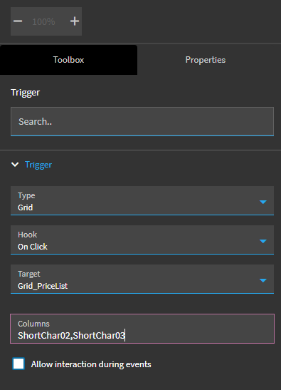
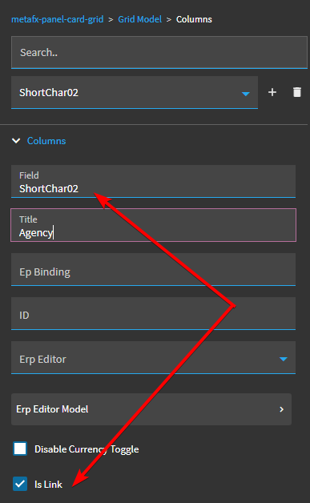
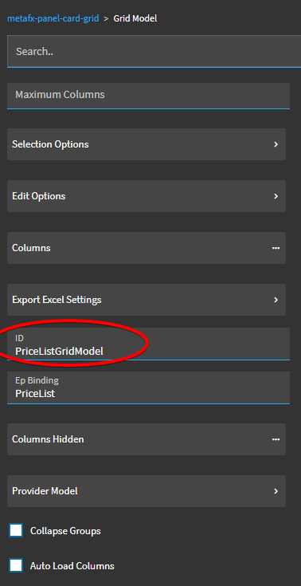

# Grid OnClick Event

Out of the box, the Kinetic "OnClick" event for a "Grid" trigger type does not work. When you set up your event, it will look like this:

Everything seems to be set up correctly, and your grid is properly bound to the specified columns:

But when you click on the column in your grid, nothing happens.

The problem is that you need to specify an `ID` value for your `GridModel` on your grid. This is **not** automatically generated. And, this `ID` must be created _before you **create**_ the event that will have the Grid OnClick trigger.

If this `ID` does not exist _before_ you even create the event that will bind to it, your event simply will not trigger.

Once you've set up the `ID` for the GridModel, you can go ahead and create your new event the same way you set up your old event, but this time, it will work:

