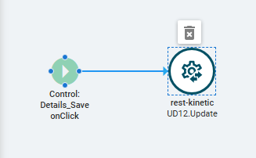
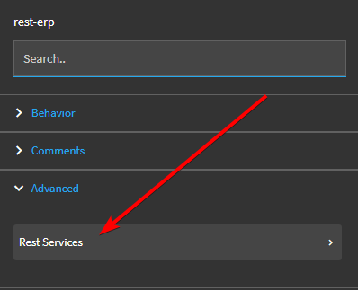
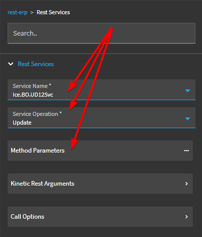
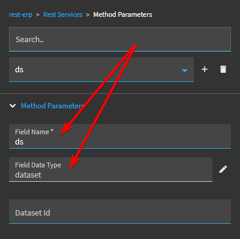
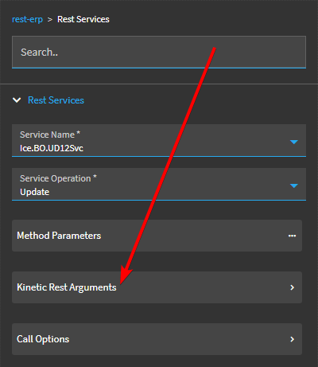
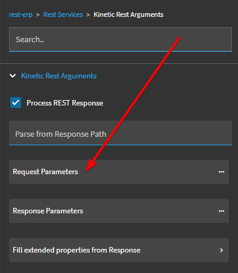
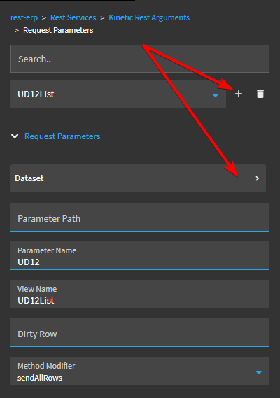
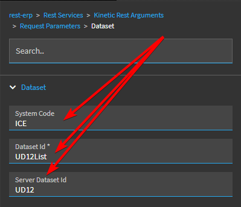
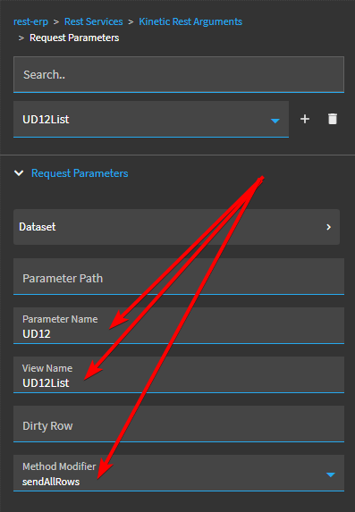

# rest-kinetic

When building a custom app or modifying an existing app using Application Studio, you will often call a method on an Epicor business object into a DataSet. Chances are, this DataSet will not have the same name as the base table the data comes from.

When you want to save changes to the data in this DataSet, you will need to call the underlying business object and method and pass in your DataSet, but rename it to match the parameter name that Epicor is expecting.

To do this, you can create an event and add the `rest-kinetic` object to your event's workflow.

Configuring the `rest-kinetic` object requires setting the correct values in the correct fields without any guidance or documentation.

**Steps:**

Click on the `Rest Services` button.

Select the business object in the `Service Name` field and the method you want to invoke in the `Service Operation` field.

Click on the `Method Parameters` button.

Make sure that there is a parameter named `ds` of type `dataset` filled out (This will probably be filled out automatically).

Leave the `Dataset Id` field blank.

Go back to the `Rest Services` and click on the `Kinetic Rest Arguments` button.

Click on the `Request Parameters` button.

Click the `+` button to create a new `Request Parameter` and then click on the `Dataset` button to configure the dataset.

Set the `System Code` to either "ICE" or "ERP" as appropriate. Enter the name of the local dataset used in your form in the `DataSet Id` field and then enter the dataset parameter that is **expected** by the method being invoked.

In this example, I am saving a local dataset named `UD12List` by invoking the `Ice.BO.UD12Svc` business object's `Update` method, so the method's REST parameters expects the dataset to be named `UD12`.

Go back to the `Request Parameters` property page. You will see that the `Request Parameter` name is now set to whatever you used as the `DataSet Id` on the previous page.

Set the `Parameter Name` field to the name of the dataset parameter that is **expected** by the method being invoked.

Set the `View Name` parameter to the name of the local dataset used in your form.

Select a `Method Modifier`. I recommend coosing the "sendAllRows" option.

If all of the fields are set correcly, your event will call the selected business object, invoke the selected method, and pass in the values from the local dataset.

If any of these fields (or any other fields that we have not discussed) are set up incorrectly, your method call will not work.

