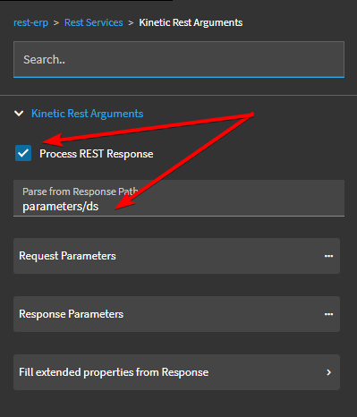
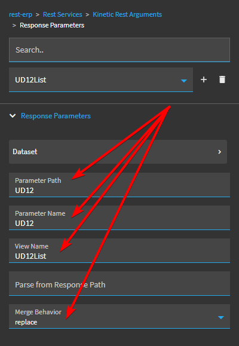
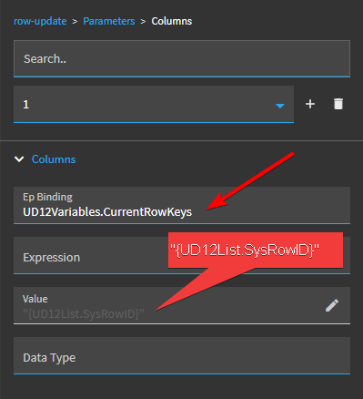
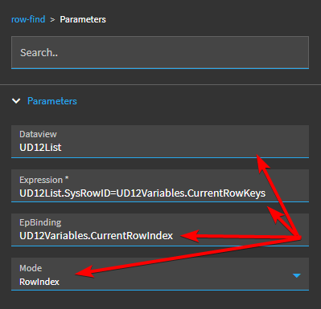
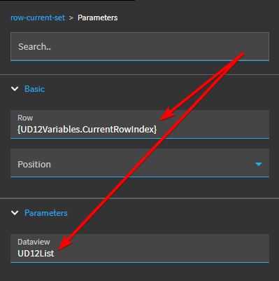

# Saving form data using a `rest-kinetic` event object

When building a custom app or modifying an existing app using Application Studio, you will often call a method on an Epicor business object into a DataSet. Chances are, this DataSet will not have the same name as the base table the data comes from.

When you want to save changes to the data in this DataSet, you will need to call the underlying business object and method and pass in your DataSet, but rename it to match the parameter name that Epicor is expecting.

To do this, you can create an event and add the `rest-kinetic` object to your event's workflow.

Configuring the `rest-kinetic` object requires setting the correct values in the correct fields without any guidance or documentation.

**Steps:**

Click on the `Rest Services` button.

Select the business object in the `Service Name` field and the method you want to invoke in the `Service Operation` field.

Click on the `Method Parameters` button.

Make sure that there is a parameter named `ds` of type `dataset` filled out (This will probably be filled out automatically).

Leave the `Dataset Id` field blank.

Go back to the `Rest Services` and click on the `Kinetic Rest Arguments` button.

Click on the `Request Parameters` button.

Click the `+` button to create a new `Request Parameter` and then click on the `Dataset` button to configure the dataset.

Set the `System Code` to either "ICE" or "ERP" as appropriate. Enter the name of the local dataset used in your form in the `DataSet Id` field and then enter the dataset parameter that is **expected** by the method being invoked.

In this example, I am saving a local dataset named `UD12List` by invoking the `Ice.BO.UD12Svc` business object's `Update` method, so the method's REST parameters expects the dataset to be named `UD12`.

Go back to the `Request Parameters` property page. You will see that the `Request Parameter` name is now set to whatever you used as the `DataSet Id` on the previous page.

Set the `Parameter Name` field to the name of the dataset parameter that is **expected** by the method being invoked.

Set the `View Name` parameter to the name of the local dataset used in your form.

Select a `Method Modifier`. I recommend coosing the "sendAllRows" option.

If all of the fields are set correcly, your event will call the selected business object, invoke the selected method, and pass in the values from the local dataset.

If any of these fields (or any other fields that we have not discussed) are set up incorrectly, your method call will not work.

### Refreshing form data

In most cases, after submitting the form data to the `Update` method on the service, you will probably want to refresh the data in your local form. This will clear the `RowMod` value and update the `SysRevID` field. If you don't refresh this data, you are likely to get an error saying "Row has been modified by another user" if you try to save the record(s) again.

Go back to the `Kinetc Rest Arguments` section and ensure that the `Process REST Response` checkbox is checked. You will need to specify the `Parse from Response Path` here to tell Epicor where to look in the response. For most standard `Update` methods in Kinetic business objects, that response will be returned under `parameters/ds`. 

Use the F12 developer tools in your browser to double-check this path before using it here.

Now click on the `Response Parameters` button and click the `+` sign to create a new parameter. In the `Parameter Path`, fill out the name of the parameter that is returned by the `Update` method. In our case, since we are calling the `UD12Svc.Update`, we are getting back a `UD12` array, so we enter "UD12" as both the `Parameter Path` and the `Parameter Name`. In the `View Name` field, enter the name of the local DataView on your form that will be replaced by the resulting data and set the `Merge Behavior` to "Replace".

Now, the downside here is that when the local DataView is refreshed after the save, the first record becomes the active record, regardless of which record you were working with when you clicked "Save."

To make sure you don't get shifted to a different record after saving the form, you will need to store the unique identifier for your current row in a variable or local DataView _before_ saving the changes, the use the `row-find` and `rod-current-set` tools to look up and navigate to the original row after refreshing the underlying data.

Find or create an event that will fire whenever a row is selected in your main DataView (You can use an event bound to the `row-changed` system event for a DataView, but understand that this will not when the DataView is first initialized and the first row is selected by default). In this event, add a `row-update` tool and configure the `Parameters => Columns` as follows:

The `Ep Binding` will point to a local variable or DataView column where you want to store the identifier. The `Value` should be a string holding the value of the unique field from your current DataView row. In cases where the primary key is a combination of fields, you will need to use something else that is unique, so I recommend using `SysRowID` to ensure you have a single field that can be used as a one-field search value.

Go back to your event that called the `Update` method or otherwise refreshed the data and add a `row-find` tool to the event workflow. In the `Dataview` field, enter the name of the DataView you are searching. In the `Expression` field, enter the comparison to use. You will want to compare the one column in your local DataView with the value you saved earlier.

**NOTE:** In true Epicor fashion, this `Expression` field does not follow the conventions established for all other `Expression` fields used in Application Studio. In this field, you won't be using the JavaScript `==` or `===` operators, nor (apparently) can you concatenate fields or turn a value into a string (`"{UD12List.SysRowID}") for evaluation. This has to be a generic comarison operator between two fields only. This is why I recommend using `SysRowID` for a unique one-column key.

In the `EpBinding` field, enter the binding for where you want to _store_ the RowIndex of the first row that matches your expression. Make sure you set the `Mode` field to "RowIndex".

Now that we've found (hopefully) a matching row, we need to set the currently-selected row to the one we found by using the saved `RowIndex`. Add a `row-current-set` tool right after the `row-find` object. You will need to set the `Row` property (Found under "Parameters => Basic") to the value you just saved and specify which DataView you want to set the current row for, as shown below:

If all of this is set up correctly, you should now be able to save your changes, refresh your local DataView with the results from the server, and remain on the same record you were editing when you clicked "Save."