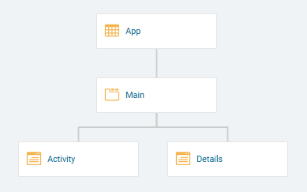
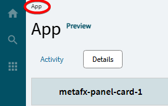

# Tips and Tricks

This page contains references that are actively being revised and refined and will find a place in other documents when they are ready.

**Enable navigation back to main `App` page**  
: A custom Kinetic app will have this basic structure when it is created:

If you want to be able to get back to the `App` page (PageType: App) from the Activity or Detail tabs (PageType: TabPage) of the `Main` page (PageType: Tab), you will need to check the `Enable Navigation` checkbox on _either_ the `Activity` or `Detail` page properties (or both). This will leave a breadcrumb-style link back to the home page from the child pages in the app:

**NOTE:** This appears only to work if the main parent page type is `App` (I can't get it to work if the form is a `Dashboard` instead of an `App`).

**NOTE2:** This appears to only work if there is only 1 page beneath the main `App` page. When there are two side-by-side pages here, it seems to break the navigation completely (Not only is there no breadcrumb menu, but some pages cannot be accessed at all, even if they are opened programaticall).

---

